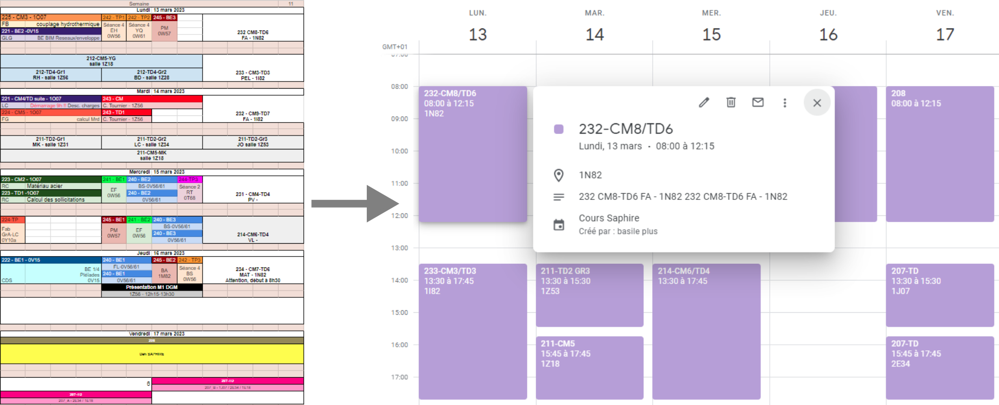
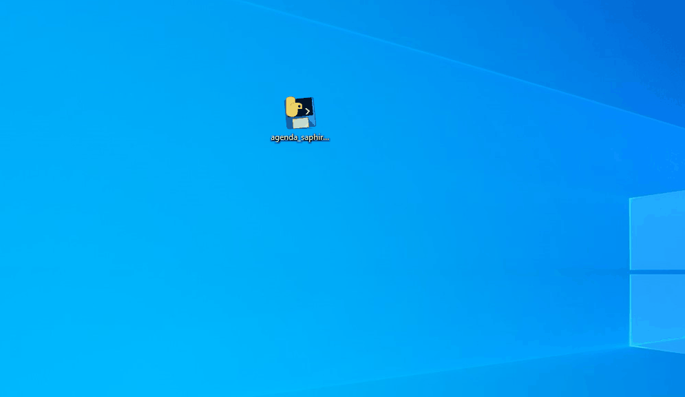

# saphire_agenda

Le programme permet, à partir du document excel accessible en ligne contenant l'emploi du temps des Saphires, de générer un fichier .ics (fichier contenant un calendrier). 
Les fichiers .ics est directement importable sur Google Agenda, Microsoft Outlook ainsi que la plupart des applications de calendrier.

L'application est simple d'utilisation. Il suffit d'entrer sa filière, ses groupes (envoyés par Pierre Mella par mail) et le nombre de semaines de l'emploi du temps à reporter sur le fichier .ics.

## Limites
  * Le programme détecte mal les évènements particuliers, comme les "partiels". Un évènement sera tout de même ajouté au calendrier mais avec le titre "Evènement particulier", le détail sera présent dans sa description.
  * Les créneau de moins de deux heures peuvent poser problème
